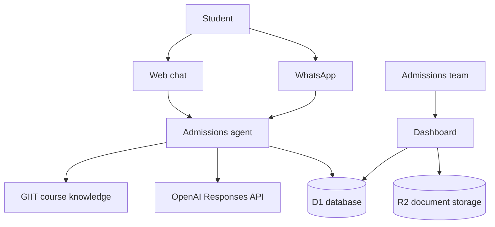

# GIIT Africa AI Admissions Agent

An AI-assisted admissions platform built for **GIIT Africa** to help prospective students explore technology careers, compare programmes, submit enquiries, and book counselling sessions through a responsive web interface and WhatsApp-ready integration.

## Live demonstration

Private review deployment: `https://giit-ai-admissions.giitafrica.chatgpt.site`

> The hosted demonstration may require authorized access. Screenshots and a public demo can be added after the production release is approved.

## What the platform does

- Recommends courses based on a student's goals, experience, and interests
- Explains programme levels, fees, durations, and career outcomes
- Captures prospective-student enquiries in a persistent database
- Accepts counselling appointment requests
- Provides an admissions dashboard for leads and bookings
- Stores uploaded course outlines, policies, and training materials
- Supports OpenAI-powered answers with a reliable built-in guidance fallback
- Includes a Meta WhatsApp Cloud API webhook foundation
- Exposes selected actions to compatible AI clients through WebMCP

## Architecture



## Technology stack

| Layer | Technology |
|---|---|
| Frontend | React 19, TypeScript, Tailwind CSS |
| Full-stack framework | Vinext / Next-compatible App Router |
| AI | OpenAI Responses API with deterministic fallback |
| Database | Cloudflare D1 with Drizzle ORM |
| Document storage | Cloudflare R2 |
| Messaging | Meta WhatsApp Cloud API webhook |
| Hosting | Cloudflare Workers-compatible runtime |
| Agent interoperability | WebMCP |

## Main application routes

| Route | Purpose |
|---|---|
| `/` | Student chat, course catalogue, counselling form, and dashboard |
| `/api/chat` | Admissions-agent responses |
| `/api/leads` | Prospect capture and lead listing |
| `/api/bookings` | Counselling requests and booking listing |
| `/api/sources` | Knowledge-document upload |
| `/api/whatsapp` | WhatsApp verification and incoming-message handling |

## Local setup

### Requirements

- Node.js 22.13 or later
- pnpm 11 or later

### Installation

```bash
git clone https://github.com/josepharayemi-netizen/giit-ai-admissions-agent.git
cd giit-ai-admissions-agent
pnpm install
cp .env.example .env
pnpm run dev
```

Open `http://localhost:5173`.

### Database migration

```bash
pnpm run db:generate
pnpm run build
```

The generated Drizzle migrations are stored in `drizzle/` and applied by the hosting workflow.

## Environment variables

Copy `.env.example` to `.env` and provide only the services you want to activate. The application still provides structured admissions guidance when OpenAI credentials are absent.

| Variable | Purpose |
|---|---|
| `OPENAI_API_KEY` | Server-side OpenAI API access |
| `OPENAI_MODEL` | OpenAI model selected for admissions responses |
| `WHATSAPP_VERIFY_TOKEN` | Meta webhook verification token |
| `WHATSAPP_ACCESS_TOKEN` | Meta WhatsApp Cloud API access token |
| `WHATSAPP_PHONE_NUMBER_ID` | Meta WhatsApp business phone-number identifier |

Never commit real credentials. Keep them in the deployment platform's encrypted environment configuration.

## Data model

- `leads` — contact details, course interest, source, and follow-up status
- `bookings` — requested date/time, selected course, notes, and status
- `knowledge_sources` — metadata for documents stored in R2

## Security notes

- OpenAI and WhatsApp credentials remain server-side.
- Uploaded files are limited in size and stored outside the relational database.
- Agent instructions prevent invented schedules, discounts, accreditations, or guarantees.
- Production deployment should protect the admissions dashboard with role-based authentication before public launch.
- Personal data collection should be accompanied by a published privacy notice and retention policy.

## Roadmap

- Role-based administrator authentication
- Retrieval-augmented answers from uploaded documents
- WhatsApp conversation history and human handoff
- Email/SMS appointment notifications
- Lead assignment, notes, and status workflows
- Analytics for popular courses and conversion rates
- CRM integration

## Author

**Joseph Arayemi**  
Founder & Managing Director, GIIT Africa  
Cybersecurity Expert · Data Scientist · Chartered CIO

## License

This portfolio project is released under the MIT License. GIIT Africa's name and branding remain the property of GIIT Africa ICT Training Limited.
